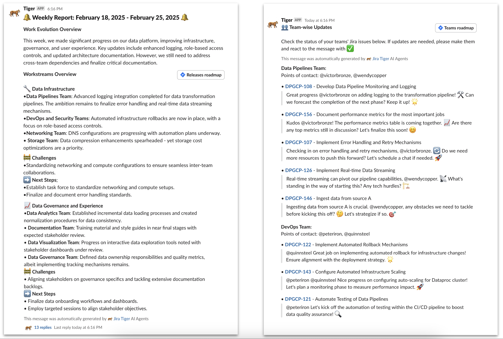

# 🐅 Jira Tiger
#### `T`ickets `I`nsights `G`eneration and `E`fficient `R`eporting

*A crew of AI agents for extracting data from Jira boards, generating reports, and requesting follow-ups on Slack.*

For a complete context about Tiger and how to set up the environment, please read the article **[Automating Jira project management with Gemini 2.0 and Crew AI](https://medium.com/data-science-collective/automating-jira-project-management-with-gemini-2-0-and-crew-ai-40a5b5d03372)**

If you replicate the same Jira Board structure shown in the article, you need to make the following adjustments in the code:

* Edit the [data extraction tool parameters](https://github.com/hugozanini/jira-tiger/blob/fe71a21c9789cb462a77d4faadeab35b8eb50b7f/src/agents/tools/data_extraction.py#L74) for the fields you want to select from your Jira board
* Edit the [workstreams names](https://github.com/hugozanini/jira-tiger/blob/fe71a21c9789cb462a77d4faadeab35b8eb50b7f/src/agents/tools/data_processing.py#L143) in the data processing tool to adapt to your project context

---

If you opted for a different config, you may need to make bigger changes to the [Tiger agents` tools](https://github.com/hugozanini/jira-tiger/tree/main/src/agents/tools).

The article shows the step-by-step instructions for running Tiger in a [Colab notebook](https://colab.research.google.com/drive/1klKQdA3u-rJPtrqB_Qjs39hj1sWc5VbB?usp=sharing).  If you decide to run it locally, here are the basic steps:

* Create a [virtual env](https://docs.python.org/3/library/venv.html#creating-virtual-environments)
* Install the tiger packages by running `pip install -e .`
* Configure the environment variables
* Run the [Tiger notebook](https://github.com/hugozanini/jira-tiger/blob/main/Tiger.ipynb)

---

### Output provided by the agents directly on slack 👇

## Acknowledgment

 This project was developed during the Vertex sprints organized by [Google’s Developer Expert Program](https://developers.google.com/community/experts). Thanks, Google, for providing GCP and Colab credits for making this happen and the continuous support for the open-source AI community.
